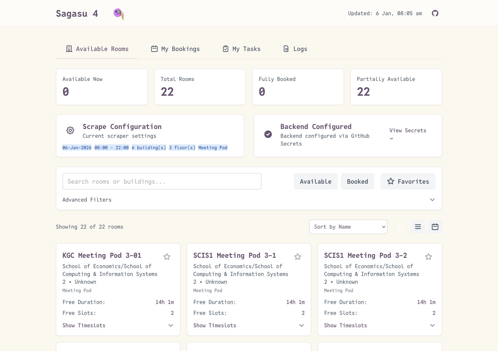
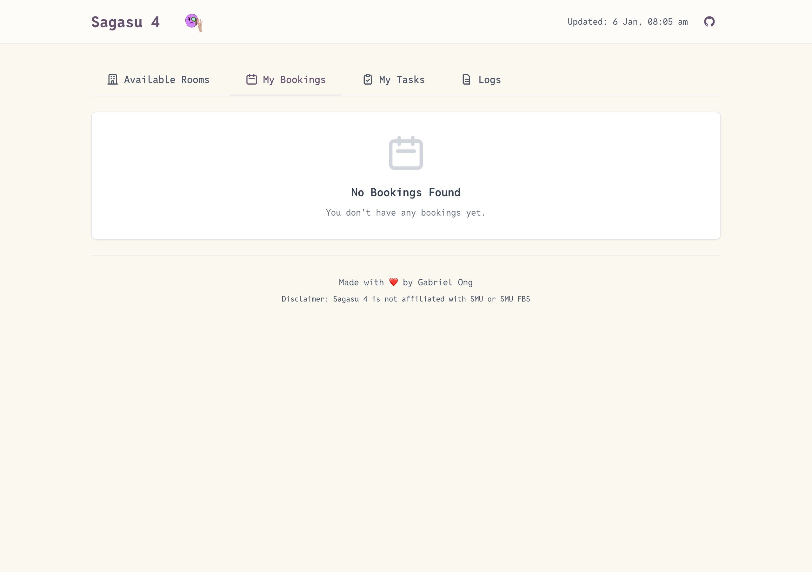
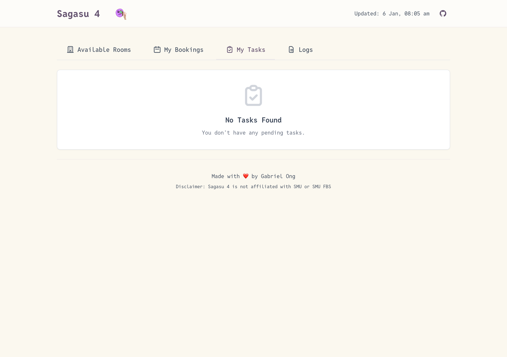
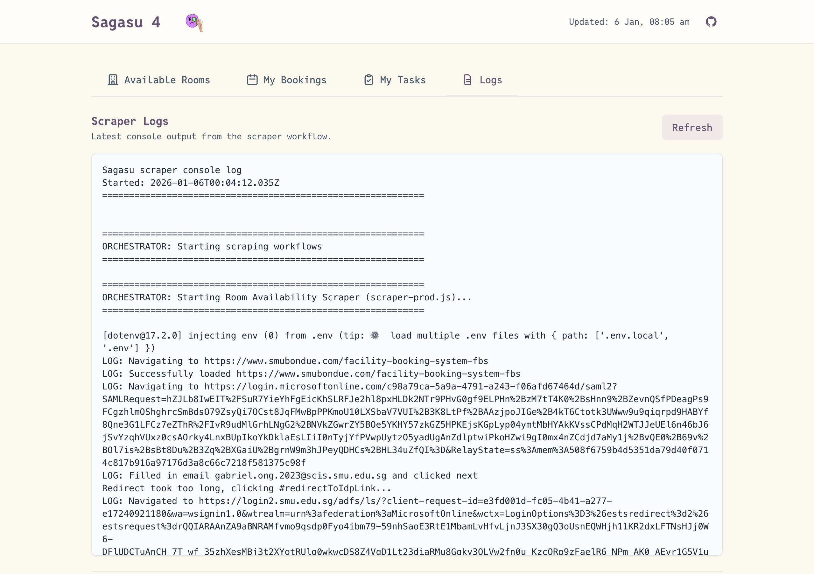

> [!WARNING]  
> [`Sagasu 4`](https://github.com/gongahkia/sagasu-4)'s Vercel deployment is inactive as of 24 January 2026.  

# `Sagasu 4`

    

[Fourth](#other-notes) time's the charm.

## Stack

* *Frontend*: [React](https://react.dev/), [Vite](https://vite.dev/), [Vercel](https://vercel.com/)
* *Backend*: [Playwright](https://github.com/microsoft/playwright), [Node.js](https://nodejs.org/en), [Github Actions](https://docs.github.com/en/actions), [Cron](https://www.ibm.com/docs/en/db2/11.5.x?topic=task-unix-cron-format)

## Rationale

See [this](https://github.com/gongahkia/sagasu#rationale), [this](https://github.com/gongahkia/sagasu-2#rationale) and [this](https://github.com/gongahkia/sagasu-3#rationale).

## Architecture

## Screenshots

  
  
  
  

## Usage

`Sagasu 4` was primarily made for my own use.

The easiest way to view `Sagasu 4` is via the ***Live Web App*** at [sagasu-4.pages.dev](https://sagasu-4.pages.dev/).

It's also the only way to access it. 

## Configuration

For those interested, `Sagasu 4` is configured with the below environment variables locally in an `.env` file for dev and [Github Secrets](https://docs.github.com/en/actions/how-tos/write-workflows/choose-what-workflows-do/use-secrets) for prod.

### Auth

| Variable | Description | 
|----------|-------------|
| `SMU_EMAIL` | Your SMU email address | 
| `SMU_PASSWORD` | Your SMU password | 

### Scraping settings

| Variable | Description | 
|----------|-------------|
| `SCRAPE_DATE` | Date to check room availability | 
| `SCRAPE_START_TIME` | Start of time window to check | 
| `SCRAPE_END_TIME` | End of time window to check | 
| `SCRAPE_ROOM_CAPACITY` | Filter rooms by capacity | 
| `SCRAPE_BUILDING_NAMES` | Buildings to search (comma-separated) 
| `SCRAPE_FLOOR_NAMES` | Floors to search (comma-separated) | 
| `SCRAPE_FACILITY_TYPES` | Types of facilities to search (comma-separated) | 
| `SCRAPE_EQUIPMENT` | Required equipment (comma-separated) | 

### Buildings

Available building options (exact names, case-sensitive):

- `School of Economics/School of Computing & Information Systems 2`
- `School of Computing & Information Systems 1`
- `School of Accountancy`
- `Lee Kong Chian School of Business`
- `Yong Pung How School of Law/Kwa Geok Choo Law Library`
- `School of Social Sciences/College of Integrative Studies`
- `Administration Building`
- `Li Ka Shing Library`
- `Sports & Recreation Centre`
- `Campus Centre`
- `Prinsep Street Residences`
- `Concourse - Room/Lab`
- `Campus Open Spaces - Events/Activities`
- `SMU Connexion`

### Floors

Available floor options (exact names, case-sensitive):

- `Basement 1`
- `Basement 2`
- `Level 1`
- `Level 2`
- `Level 3`
- `Level 4`
- `Level 5`
- `Level 6`
- `Level 7`

### Facility Types

Available facility type options:

- `Project Room`
- `Project Room (Level 5)`
- `Discussion Room`
- `Seminar Room`
- `Classroom`
- `Chatterbox`
- `Group Study Room`
- `Hostel Facilities`
- `Meeting Pod`
- `MPH / Sports Hall`
- `Phone Booth`
- `SMUC Facilities`
- `Student Activities Area`
- `Study Booth`

### Equipment

Available equipment options:

- `Classroom PC`
- `Classroom Prompter`
- `Clip-on Mic`
- `Doc Camera`
- `DVD Player`
- `Gooseneck Mic`
- `Handheld Mic`
- `Hybrid (USB connection)`
- `In-room VC System`
- `Projector`
- `Rostrum Mic`
- `Teams Room`
- `Teams Room NEAT Board`
- `TV Panel`
- `USB Connection VC room`
- `Video Recording`
- `Wired Mic`
- `Wireless Projection`       

## Other notes

`Sagasu 4` is where it is today because of the below projects. 

* [Sagasu](https://github.com/gongahkia/sagasu)
* [Sagasu 2](https://github.com/gongahkia/sagasu-2)
* [Sagasu 3](https://github.com/gongahkia/sagasu-3)
