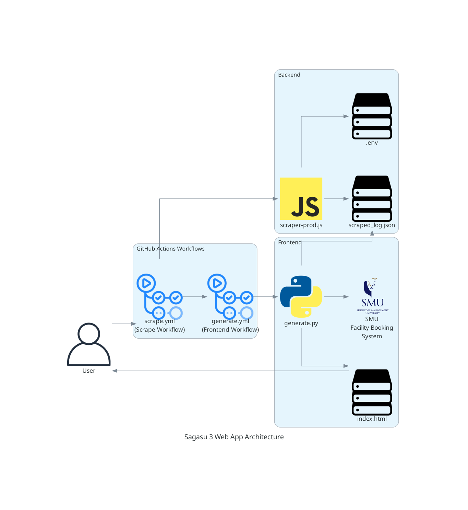

todo

- continue debugging the broken booking logic (unable to find the time from and time to)
- actually implement the booking logic (via dragging/dropping the room bookings) and automate that for myself to book fbs rooms during this exam period
- have that displayed on the frontend
- ensure everything looks clean on desktop and mobile
- furnish the README.md
- add a button to the navbar to automatically star the project on Github if they like it 

# `Sagasu 4`

    

...

## Stack

* *Frontend*: [React](https://react.dev/), [Vite](https://vite.dev/), [Cloudflare Pages](https://pages.cloudflare.com/)
* *Backend*: [Playwright](https://github.com/microsoft/playwright), [Node.js](https://nodejs.org/en), [Github Actions](https://docs.github.com/en/actions), [Cron](https://www.ibm.com/docs/en/db2/11.5.x?topic=task-unix-cron-format)

## Rationale

...

## Architecture

## Screenshots

...

## Usage

...

## Configuration

...

## Other notes

`Sagasu 4` is where it is today because of the below projects. 

* [Sagasu](https://github.com/gongahkia/sagasu)
* [Sagasu 2](https://github.com/gongahkia/sagasu-2)
* [Sagasu 3](https://github.com/gongahkia/sagasu-3)
